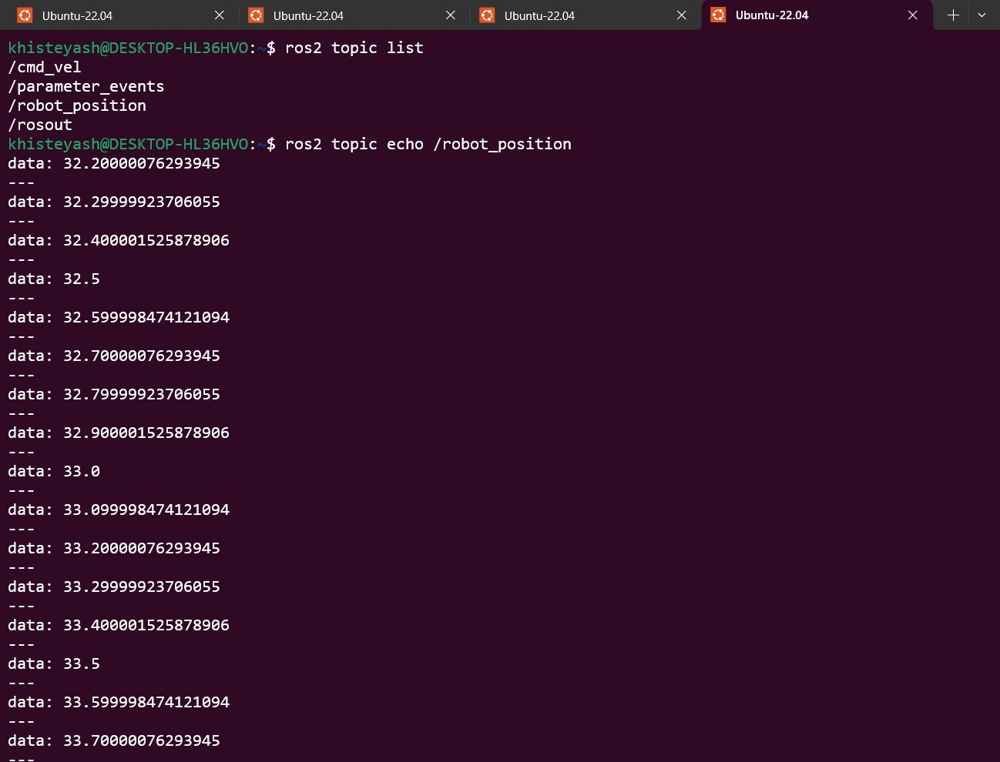
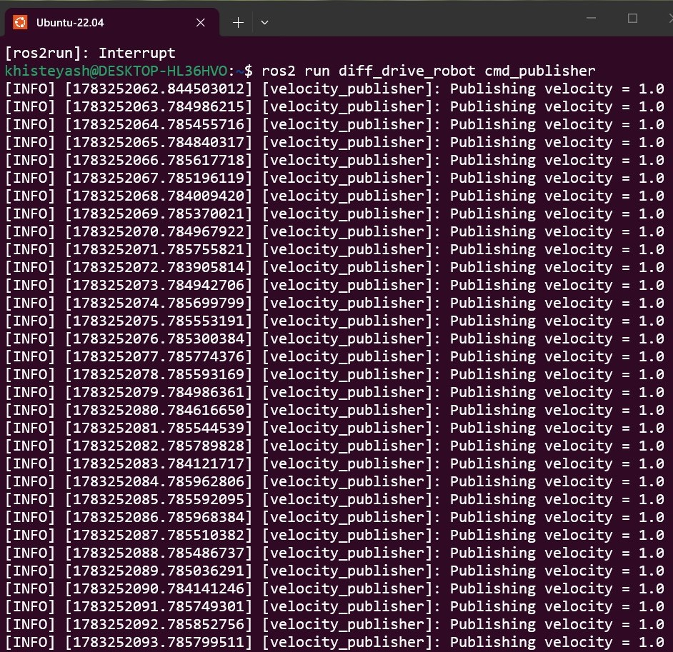
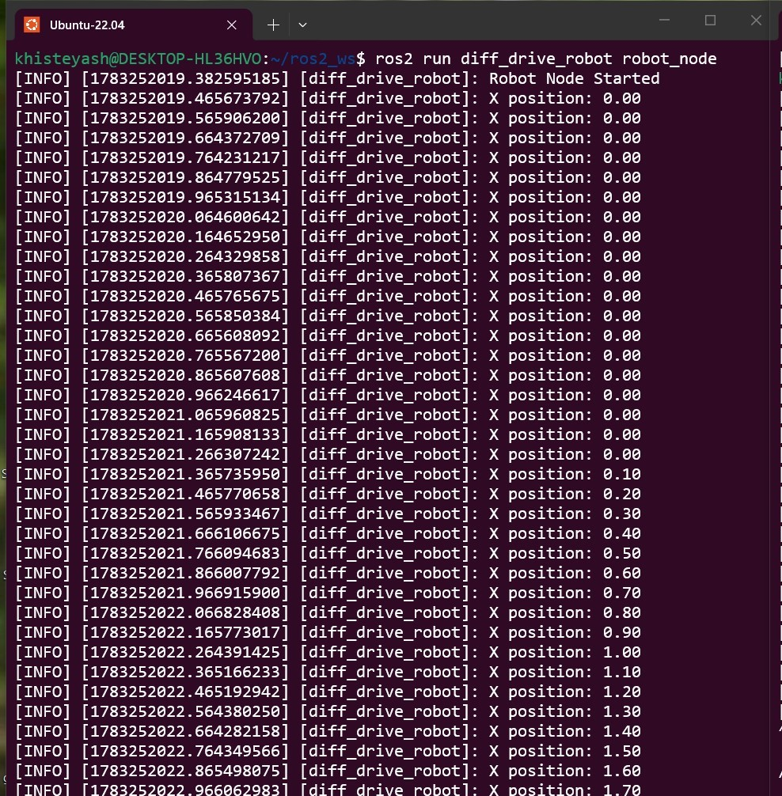
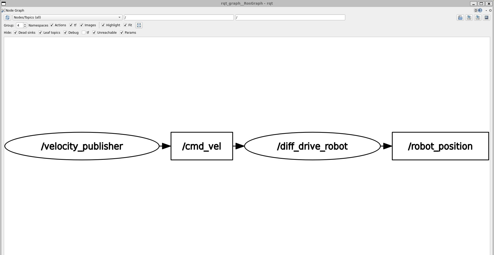

# ROS2 Differential Drive Robot Controller

A ROS2 Humble mobile-robot control project implementing differential-drive kinematics, odometry, TF2, modular URDF/Xacro modeling, joint-state publishing, and RViz2 visualization in Python.

The project is developed as a practical robotics engineering portfolio, progressing from robot modeling and motion control toward simulation, localization, and autonomous navigation.


---

## Engineering Highlights

* **Built a differential-drive motion controller** using ROS2 `rclpy` and planar kinematics, converting `/cmd_vel` velocity commands into simulated robot pose updates.

* **Implemented robot odometry estimation** by integrating linear and angular velocity over time, publishing `nav_msgs/msg/Odometry` through `/odom`.

* **Implemented dynamic TF2 broadcasting** using `odom → base_link`, providing the robot's runtime coordinate transformation for visualization and downstream robotics components.

* **Developed a modular robot description** using URDF/Xacro, separating the chassis, wheels, and materials into reusable robot-description components.

* **Added drive-wheel and caster geometry** using dedicated links and joints, creating a complete differential-drive mobile robot model.

* **Added collision and inertial properties** to the robot description, providing physically meaningful geometry and mass properties for future physics-based simulation.

* **Integrated `joint_state_publisher` and `robot_state_publisher`** to generate the robot's link and joint transformation hierarchy.

* **Built a ROS2 launch workflow** that dynamically processes the Xacro model and starts the controller, command publisher, state publishers, and RViz2 visualization.

* **Validated the robot description** using Xacro generation and `check_urdf`, confirming successful XML parsing and a valid link/joint structure.

* **Validated ROS2 runtime behavior** using node, topic, odometry-frequency, and TF inspection commands.

* **Structured the project as a standard ROS2 Python package** with package metadata, launch files, RViz configuration, robot description, resources, console entry points, and automated tests.

---

# System Architecture

```text
                         /cmd_vel
                            │
                            ▼
                   ┌─────────────────┐
                   │  cmd_publisher  │
                   └────────┬────────┘
                            │
                            ▼
                   ┌─────────────────┐
                   │   robot_node    │
                   │                 │
                   │ Differential    │
                   │ Drive Kinematics│
                   └────────┬────────┘
                            │
                 ┌──────────┴──────────┐
                 │                     │
                 ▼                     ▼
              /odom                   TF2
                 │                     │
                 │                     ▼
                 │              odom → base_link
                 │                     │
                 │                     ▼
                 │             robot_state_publisher
                 │                     │
                 │          ┌──────────┼──────────┐
                 │          ▼          ▼          ▼
                 │      left_wheel right_wheel caster_wheel
                 │
                 ▼
             Robot Pose
```

---

# Technical Implementation

## 1. Differential-Drive Motion Control

**Implemented:** Differential-drive robot motion control.

**How:** ROS2 `rclpy` receives `geometry_msgs/msg/Twist` commands from `/cmd_vel` and applies planar differential-drive motion equations.

The robot state is represented by:

```text
x
y
θ
```

with:

```text
ẋ = v cos(θ)

ẏ = v sin(θ)

θ̇ = ω
```

**Result:** Linear and angular velocity commands produce continuously updated robot motion and orientation.

---

## 2. ROS2 Command Interface

**Implemented:** A dedicated velocity-command publisher.

**How:** `cmd_publisher` publishes `geometry_msgs/msg/Twist` messages to:

```text
/cmd_vel
```

**Result:** Robot motion is controlled through a standard ROS2 velocity-command interface.

---

## 3. Odometry

**Implemented:** Runtime robot odometry.

**How:** The controller integrates linear and angular motion over time and publishes:

```text
/odom
```

using:

```text
nav_msgs/msg/Odometry
```

**Result:** The system provides continuously updated robot position, orientation, linear velocity, and angular velocity.

The odometry publisher has been validated at approximately:

```text
10 Hz
```

---

## 4. TF2 Coordinate Frames

**Implemented:** Dynamic robot coordinate transformation.

**How:** `robot_node` broadcasts:

```text
odom → base_link
```

through TF2.

**Result:** The robot's dynamic pose becomes available through the ROS2 coordinate-frame system and can be consumed by visualization and future localization/navigation components.

---

## 5. Modular URDF/Xacro Robot Model

**Implemented:** A modular robot-description architecture.

**How:** The original robot description was separated into reusable Xacro components:

```text
urdf/
├── robot.urdf.xacro
├── base.xacro
├── wheels.xacro
└── materials.xacro
```

**Result:** Chassis, wheel, and material definitions can be modified independently, making the robot model easier to extend.

---

## 6. Robot Geometry and Physical Properties

**Implemented:** Chassis, drive wheels, and caster-wheel modeling.

**How:** Xacro definitions provide visual geometry, collision geometry, mass, inertial properties, and joints.

**Result:** The robot model contains both visualization-ready and collision-ready geometry, establishing a foundation for future physics simulation.

---

## 7. Robot State Publishing

**Implemented:** Joint-state and robot-state publishing.

**How:** `joint_state_publisher` provides joint-state information while `robot_state_publisher` converts the robot's link/joint structure into TF2 transformations.

**Result:** The robot model is represented through a connected link hierarchy:

```text
base_link
├── left_wheel
├── right_wheel
└── caster_wheel
```

---

## 8. Xacro-Based Launch System

**Implemented:** Automated robot startup and visualization.

**How:** `robot_view.launch.py` dynamically processes:

```text
robot.urdf.xacro
```

and passes the generated robot description to the ROS2 state-publishing system.

**Result:** The complete robot visualization stack can be started with one command:

```bash
ros2 launch diff_drive_robot robot_view.launch.py
```

---

# Results & Engineering Evidence

## RViz2 Robot Model


**Result:** Verified the modular Xacro robot description in RViz2 with the chassis, drive wheels, and caster wheel represented as connected robot links.

---

## ROS2 Runtime Nodes



**Result:** Verified the active ROS2 runtime architecture, including the controller, command publisher, robot-state publisher, joint-state publisher, and RViz2.

---

## Velocity Command Interface



**Result:** Verified continuous `geometry_msgs/msg/Twist` command publication through `/cmd_vel`.

---

## Robot Position and Motion



**Result:** Verified integrated robot motion and changing pose during runtime execution.

---

## Runtime Data



**Result:** Captured runtime ROS2 data used to verify controller and robot-state behavior during development.

---

# Validation

The ROS2 package and robot description have been validated through static and runtime checks.

## Package Build

```bash
cd ~/ros2_ws

colcon build --symlink-install

source install/setup.bash
```

Successful build result:

```text
Starting >>> diff_drive_robot
Finished <<< diff_drive_robot

Summary: 1 package finished
```

---

## Xacro Generation

```bash
ros2 run xacro xacro \
src/diff_drive_robot/urdf/robot.urdf.xacro \
> /tmp/robot_test.urdf
```

---

## URDF Validation

```bash
check_urdf /tmp/robot_test.urdf
```

Validated robot structure:

```text
robot name: diff_drive_robot

root Link: base_link

child links:
- caster_wheel
- left_wheel
- right_wheel
```

---

## ROS2 Package Discovery

```bash
ros2 pkg prefix diff_drive_robot
```

The package is successfully discovered from the built ROS2 workspace.

---

# ROS2 Interfaces

| Interface            | Type                      | Function                           |
| -------------------- | ------------------------- | ---------------------------------- |
| `/cmd_vel`           | `geometry_msgs/msg/Twist` | Velocity command input             |
| `/odom`              | `nav_msgs/msg/Odometry`   | Robot pose and velocity estimation |
| `/tf`                | `tf2_msgs/msg/TFMessage`  | Coordinate transformations         |
| `/robot_description` | Robot description         | Robot model information            |

---

# Runtime Verification

### Inspect Nodes

```bash
ros2 node list
```

### Inspect Topics

```bash
ros2 topic list
```

### Monitor Velocity Commands

```bash
ros2 topic echo /cmd_vel
```

### Monitor Odometry

```bash
ros2 topic echo /odom
```

### Measure Odometry Frequency

```bash
ros2 topic hz /odom
```

### Inspect TF Frames

```bash
ros2 run tf2_tools view_frames
```

### Measure TF Frequency

```bash
ros2 topic hz /tf
```

---

# Repository Structure

```text
ros2-differential-drive-controller/
│
├── README.md
├── .gitignore
├── screenshots/
│
└── src/
    └── diff_drive_robot/
        │
        ├── diff_drive_robot/
        │   ├── __init__.py
        │   ├── cmd_publisher.py
        │   └── robot_node.py
        │
        ├── config/
        │   └── robot_view.rviz
        │
        ├── launch/
        │   └── robot_view.launch.py
        │
        ├── resource/
        │   └── diff_drive_robot
        │
        ├── test/
        │   ├── test_copyright.py
        │   ├── test_flake8.py
        │   └── test_pep257.py
        │
        ├── urdf/
        │   ├── base.xacro
        │   ├── materials.xacro
        │   ├── robot.urdf.xacro
        │   └── wheels.xacro
        │
        ├── package.xml
        ├── setup.cfg
        └── setup.py
```

---

# Build and Run

## Requirements

* Ubuntu 22.04
* ROS2 Humble
* Python 3
* Colcon
* Xacro
* RViz2
* Git

The project has been developed and tested using Ubuntu 22.04 under WSL2 on Windows.

---

## Clone

```bash
mkdir -p ~/ros2_ws/src

cd ~/ros2_ws/src

git clone https://github.com/yashrk7174/ros2-differential-drive-controller.git
```

---

## Build

```bash
cd ~/ros2_ws

colcon build --symlink-install

source install/setup.bash
```

---

## Launch

```bash
ros2 launch diff_drive_robot robot_view.launch.py
```

---

# Development Roadmap

## Completed

* [x] ROS2 Humble development environment
* [x] ROS2 workspace and Python package
* [x] Publisher/subscriber communication
* [x] `/cmd_vel` velocity interface
* [x] Differential-drive kinematics
* [x] Robot pose integration
* [x] `/odom` odometry publisher
* [x] Dynamic `odom → base_link` TF2
* [x] Professional URDF robot model
* [x] Chassis collision geometry
* [x] Inertial and mass properties
* [x] Drive-wheel links and joints
* [x] Caster-wheel model
* [x] Joint-state publishing
* [x] `robot_state_publisher`
* [x] RViz2 visualization
* [x] Modular Xacro architecture
* [x] Separate base, wheel, and material Xacro files
* [x] ROS2 launch system
* [x] Xacro and URDF validation
* [x] Standard ROS2 package structure
* [x] Git/GitHub project organization

## Next Development Phase

* [ ] Introduce `base_footprint`
* [ ] Separate dynamic and static TF ownership
* [ ] Improve mobile-robot TF architecture
* [ ] Parameterize robot dimensions and controller settings
* [ ] Improve wheel-level motion modeling
* [ ] Implement realistic wheel odometry
* [ ] Add PID-based velocity control

## Future Robotics Stack

* [ ] `ros2_control`
* [ ] Gazebo simulation
* [ ] Sensor simulation
* [ ] LiDAR integration
* [ ] Robot localization
* [ ] SLAM
* [ ] Nav2 autonomous navigation
* [ ] Autonomous waypoint following
* [ ] Automated ROS2 integration testing

---

# Technologies

```text
ROS2 Humble
Python
rclpy
Differential-Drive Kinematics
URDF
Xacro
TF2
robot_state_publisher
joint_state_publisher
RViz2
Ubuntu 22.04
WSL2
Linux
Git
GitHub
Colcon
```

---

# Engineering Focus

This project is being developed toward an industrial mobile-robot software stack:

```text
Robot Modeling
      ↓
ROS2 Communication
      ↓
Kinematics
      ↓
Odometry
      ↓
TF2
      ↓
Robot State Representation
      ↓
Control
      ↓
Simulation
      ↓
Localization
      ↓
Navigation
```

The implementation emphasizes **modular robot modeling, ROS2 communication, coordinate-frame correctness, runtime validation, and incremental integration of robotics control and autonomy components.**

---

# Author

**Yash Khiste**

M.Sc. Electrical Engineering and Information Technology
Otto von Guericke University Magdeburg, Germany

### Focus Areas

* Robotics
* Control Systems
* Industrial Automation
* Mobile Robotics
* ROS2 Development
* Robot Control
* Systems and Automation Engineering
